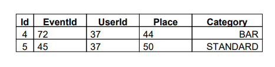

# pdp-spring-mvc

project for resolving tasks from _**Spring MVC**_ module in scope of preparing to assesment.

## Task
### Create a Spring-based module, which handles event ticket booking. 

Rules:
- Transform project from Spring Introduction module into a web application, configure dispatcher servlet.
- Implement annotation-based controllers that will delegate to BookingFacade methods. For methods, that accept Entity, just send the list of parameters from the client and assemble the entity in the controller, no need for automatic conversion of request payload to java object.
- For methods, that should return a single entity or entity list result (e.g. getUsersByName), implement simple thymeleaf templates for displaying results. No sophisticated markup required, just the fact that you know how to implement the chain:
ModelAndView à Resolver à ThymeleafTemplate à Html page in the browser.
- For the following facade method:
List getBookedTickets(User user, int pageSize, int pageNum);
Implement alternative controller, which will be mapped on header value "accept=application/pdf" and return PDF version of booked tickets list.
 Example of PDF report:
 
- Implement batch creation of ticket bookings from XML file. Source file example:
Add a method public void preloadTickets() to facade that will load this file from some predefined place (or from a location specified in parameter), unmarshal ticket objects using Spring OXM capabilities and update the storage. The whole batch should be performed in a single transaction, using programmatic transaction management.
- Implement custom HandlerExceptionResolver, which in case of controller exception just send a simple text response to the client with a brief description of the error.
- Unit tests, logging, javadocs.
